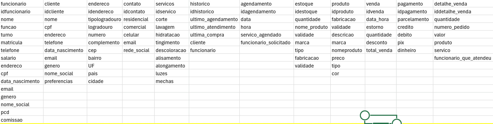
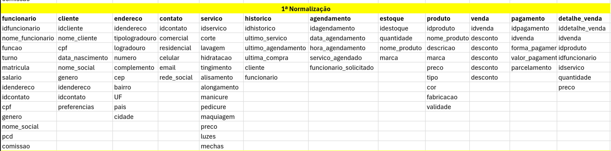
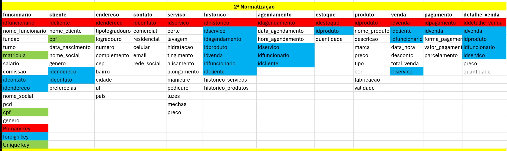
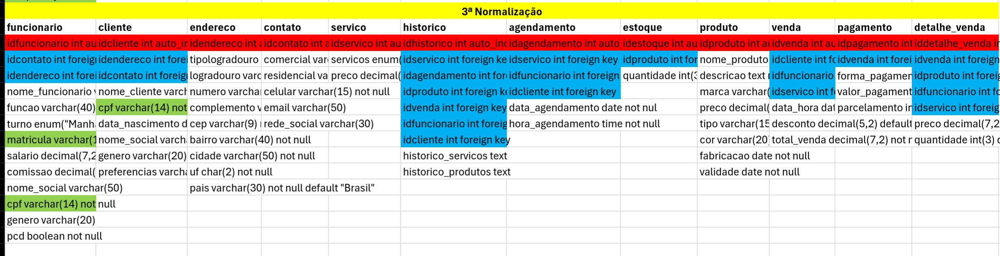

# Atividades

## Cabelos Incriveis

#### o salão de cabeleiro "Cabelos incriveis" é um estabelecimento localizado em uma area movimentada dA cidade. o salão oferece uma varidade de serviços, incluido cortes de cabelo, coloração, tratamentos capilares, mancures, e pedicure.eles têm uma equipe automatizar esses processos

# Requisitos do Sistema:

### Gerenciamento de Clientes:

#### - Cadastro de novos clientes com informaçoes como nome, endereço, telefone , e-mail, prefências de serviços, historico de serviços realizados,etc

#### - Registro de serviços realizados por cada cliente incluido datas,tipos de serviços,cabeleirero responsavel,etc

#### - Possibilidade de atualização e exclusão de informações de clientes.

## 

# Agendamento de serviços:

#### - Capacidade de agendar serviços para clientes, incluindo data, horario, tipo de serviço, cabeleirero responsavel , etc

#### - Visualização rapida de disponbilidade de horarios e cabeleiros para agendamentos.

# Gereciamento de Estoque:

## Controle de estoque de produtos utilzados no salão , como tinturas,condicionadores,etc.

#### Registro de entrada e saida de produtos, incluindo quantidades e datas.

# Informações dos Funcionarios:

#### Cadastro de informaçoes dos funcionarios, incluindo nome, função, horario de trabalho, salario, etc.

#### Atribuição de serviços realizados por cada funcionarios e acompanhamento de seu desempenho.

# Modelo logico

# 1- Primeira normalização

# 2 - Segundo normalização

# 3 - Terceiro normalização

# Modelo pratica

#### create database cabelos_incriveisdb;
# use cabelos_incriveisdb;

#### drop table if exists `funcionaria`;
#### create table `funcionaria` (
####   idfuncionaria int(12) NOT NULL AUTO_INCREMENT,
####   nomefuncionaria varchar(50) NOT NULL,
####   salario decimal (7,5) NOT NULL,
 ####  cpf varchar (15) NOT NULL,
  #### email varchar(50) default null,
  #### telefonecelular varchar(15) not null,
  #### primary key(idfuncionaria),
 ####  ALTER TABLE funcionaria ADD CONSTRAINT funcionaria_idcontatos_contatos_idcontatos FOREIGN KEY (idcontatos) REFERENCES contato(idcontatos)
 ####  ALTER TABLE funcionario ADD CONSTRAINT funcionario_idendereco_endereco_idendereco FOREIGN KEY (idendereco) REFERENCES endereco(idendereco)
  
  #### );
  
  
  #### DROP TABLE IF EXISTS `contatos`;
#### CREATE TABLE `contatos` (

  #### `idcontatos` int(12) NOT NULL AUTO_INCREMENT,
 ####  `telefonecomercio` varchar(15) DEFAULT NULL,
  #### `telefonecelular` varchar(15) NOT NULL,
  #### `email` varchar(50) DEFAULT NULL,
  #### `redesocial` varchar(45) DEFAULT NULL,
  #### PRIMARY KEY (`idcontatos`)
  
 #### ####  );
  
#### DROP TABLE IF EXISTS `endereco`;
#### CREATE TABLE `endereco` (

  #### `idendereco` int(12) NOT NULL AUTO_INCREMENT,
  #### `tipLogradouro` enum('R.','Av','Viela','Praça','Vila') NOT NULL,
  #### `logradouro` varchar(50) NOT NULL,
 ####  `numero` varchar(10) NOT NULL,
  #### `complemento` varchar(20) NOT NULL,
  #### `cep` varchar(9) NOT NULL,
 ####  `bairro` varchar(35) NOT NULL,
  #### `cidade` varchar(35) NOT NULL,
  #### `estado` varchar(20) NOT NULL,
  #### `pais` varchar(20) NOT NULL DEFAULT 'Brasil',
 ####  PRIMARY KEY (`idendereco`)
  
 ####  );
  
  
  
  #### DROP TABLE IF EXISTS `pagamento`;
#### CREATE TABLE `pagamento` (

  #### `idpagamento` int(11) NOT NULL AUTO_INCREMENT,
 ####  `idvenda` int(11) DEFAULT NULL,
 ####  `formapagamento` enum('Dinheiro','Débito','Crédito','Pix') DEFAULT NULL,
  #### `parcelamento` int(11) NOT NULL DEFAULT 1,
  #### #### `valorpag` decimal(6,2) NOT NULL,
  #### PRIMARY KEY (`idpagamento`),
 ####  KEY `fk_pagamento_pk_venda` (`idvenda`),
  #### CONSTRAINT `fk_pagamento_pk_venda` FOREIGN KEY (`idvenda`) REFERENCES `venda` (`idvenda`)
  
#### );

#### create table agedamento(
#### idagendamento int auto_increment primary key,
#### idcliente int,
#### dataagedamento date not null,
#### horaagedamento time not null,
#### observacao text
#### );

#### DROP TABLE IF EXISTS `clientes`;
#### CREATE TABLE `clientes` (

 ####  `idclientes` int(12) NOT NULL AUTO_INCREMENT,
 ####  `nomeclientes` varchar(60) NOT NULL,
  #### `cpf` varchar(14) NOT NULL,
  #### `datanascimento` date NOT NULL,
  #### `sexo` varchar(20) DEFAULT NULL,
  #### `idendereco` int(15) DEFAULT NULL,
  #### `idcontato` int(15) DEFAULT NULL,
  #### PRIMARY KEY (`idclientes`),
  #### UNIQUE KEY `cpf` (`cpf`),
  #### KEY `fk_cliente_pk_endereco` (`idendereco`),
  ####  KEY `fk_cliente_pk_contatos` (`idcontatos`),
  #### ALTER TABLE cliente ADD CONSTRAINT clientes_idendereco_endereco_idendereco FOREIGN KEY (idendereco) REFERENCES endereco(idendereco)
  #### ALTER TABLE cliente ADD CONSTRAINT clientes_idcontatos_contatos_idcontatos FOREIGN KEY (idcontatos) REFERENCES contatos(idcontatos)
 ####  );
  
  #### CREATE TABLE estoque (
#### idestoque INT PRIMARY KEY AUTO_INCREMENT NOT NULL,
#### idproduto INT NOT NULL,
#### quantidade INT(3) NOT NULL DEFAULT not null);

#### CREATE TABLE detalhe_venda (
#### iddetalhe_venda INT PRIMARY KEY AUTO_INCREMENT NOT NULL,
#### idvenda INT NOT NULL,
#### idproduto INT NOT NULL,
#### #### idfuncionario INT NOT NULL,
#### idservico INT NOT NULL,
#### preco DECIMAL(7,2) NOT NULL,
#### quantidade INT(3) NOT NULL DEFAULT 1)
#### ALTER TABLE detalhe_venda ADD CONSTRAINT detalhe_venda_idvenda_venda_idvenda FOREIGN KEY (idvenda) REFERENCES venda(idvenda);
#### ALTER TABLE detalhe_venda ADD CONSTRAINT detalhe_venda_idproduto_produto_idproduto FOREIGN KEY (idproduto) REFERENCES produto(idproduto);
#### ALTER TABLE detalhe_venda ADD CONSTRAINT detalhe_venda_idfuncionaria_funcionaria_idfuncionaria FOREIGN KEY (idfuncionaria) REFERENCES funcionaria(idfuncionaria);
#### ALTER TABLE detalhe_venda ADD CONSTRAINT detalhe_venda_idservico_servico_idservico FOREIGN KEY (idservico) REFERENCES servico(idservico);

#### CREATE TABLE historico (
#### idhistorico INT PRIMARY KEY AUTO_INCREMENT NOT NULL,
#### idservico INT NOT NULL,
#### idagendamento INT NOT NULL,
#### idproduto INT NOT NULL,
#### idvenda INT NOT NULL,
#### idfuncionario INT NOT NULL,
#### idcliente INT NOT NULL,
#### historico_servicos TEXT,
#### historico_produtos TEXT);

#### CREATE TABLE produto (
#### idproduto INT PRIMARY KEY AUTO_INCREMENT NOT NULL,
#### nome_produto VARCHAR(40) NOT NULL DEFAULT not null,
#### descricao TEXT NOT NULL DEFAULT not null,
#### marca VARCHAR(15) NOT NULL DEFAULT not null,
#### preco DECIMAL(6,2) NOT NULL DEFAULT not null,
#### tipo VARCHAR(15) NOT NULL DEFAULT not null,
#### cor VARCHAR(20) NOT NULL DEFAULT not null,
#### fabricacao DATE NOT NULL DEFAULT not nul,
#### validade DATE NOT NULL DEFAULT not null);

#### CREATE TABLE venda (
#### idvenda INT PRIMARY KEY AUTO_INCREMENT NOT NULL,
#### idcliente INT NOT NULL,
#### idfuncionario INT NOT NULL,
#### idservico INT NOT NULL,
#### data_hora DATETIME NOT NULL DEFAULT current_timestamp(),
#### desconto DECIMAL(5,2) DEFAULT default 0,
#### total_venda DECIMAL(7,2) NOT NULL DEFAULT not null);
#### ALTER TABLE venda ADD CONSTRAINT venda_idcliente_cliente_idcliente FOREIGN KEY (idcliente) REFERENCES cliente(idcliente)
#### ALTER TABLE venda ADD CONSTRAINT venda_idfuncionario_funcionario_idfuncionario FOREIGN KEY (idfuncionario) REFERENCES funcionario(idfuncionario)
#### ALTER TABLE venda ADD CONSTRAINT venda_idservico_servico_idservico FOREIGN KEY (idservico) REFERENCES servico(idservico)
  
  
  
  
  
  
  
  

